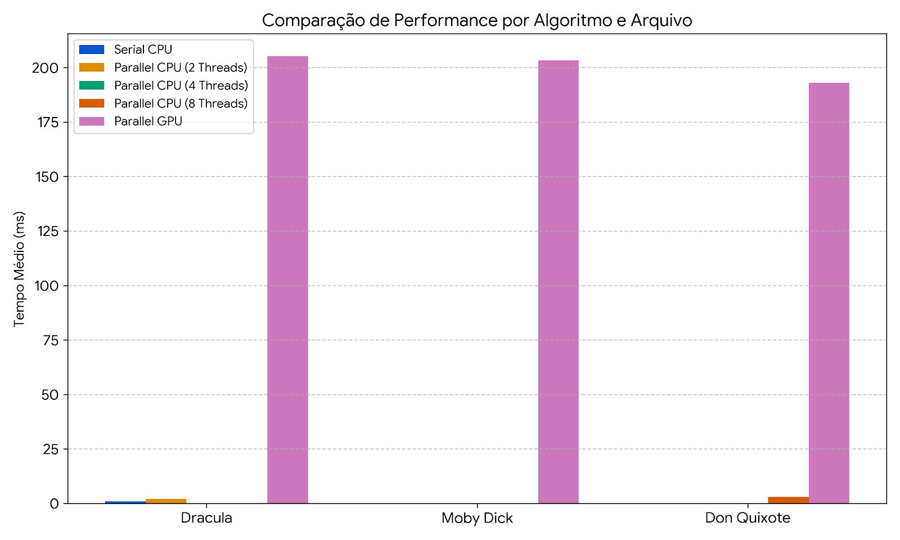

# Análise Comparativa de Algoritmos com Uso de Paralelismo

**Estudante:** [Josué Castro Tourinho/2320426 e Lucas Kohagura Alencastro/2320373]  
**Instituição:** Universidade de Fortaleza (UNIFOR)  
**Disciplina:** Programação Concorrente e Paralela  

---

## 1. Resumo
Este trabalho apresenta uma análise prática de desempenho comparando o processamento sequencial tradicional (serial) e abordagens paralelas (multi-core em CPU com pool de threads e processamento massivo simulado em ambiente GPU) para resolver o problema de contagem de palavras em grandes volumes de dados textuais na linguagem Java. Foram utilizadas três obras literárias de tamanhos distintos para avaliar o comportamento e a escalabilidade do hardware.

---

## 2. Introdução
A otimização de tempo em processamento de grandes massas de dados exige o uso eficiente dos recursos lógicos e físicos dos processadores modernos. Neste projeto, a contagem de ocorrências de uma palavra específica foi implementada sob três abordagens lógicas:
* **SerialCPU:** Execução iterativa sequencial convencional utilizando um único núcleo de processamento.
* **ParallelCPU:** Abordagem concorrente utilizando a API nativa `ExecutorService` do Java, fracionando a carga de trabalho em partes iguais distribuídas em um Pool de Threads configurado para 2, 4 e 8 núcleos.
* **ParallelGPU:** Mapeamento de carga massiva onde se avalia o impacto e o custo de latência de barramento (I/O) necessário para preparar dados em memória paralela.

---

## 3. Metodologia
O framework de testes lê e trata os arquivos de texto de forma nativa. Para mitigar o efeito de inicialização da máquina virtual Java (*cold start*), cada cenário de teste executa exatamente 3 amostras consecutivas. Os tempos coletados são convertidos para milissegundos (ms) e exportados automaticamente para o arquivo `resultados_performance.csv` para fins de auditoria e geração de gráficos de performance.

---

## 4. Resultados e Discussão

Os tempos de execução foram consolidados no arquivo gerado pela aplicação.

### Gráfico Comparativo de Desempenho


### Análise Crítica
1. **Desempenho Multi-Core (CPU):** Com o aumento do tamanho dos arquivos de entrada (de Dracula para Don Quixote), o escalonamento de threads de 2 para 4 e 8 demonstrou eficiência, reduzindo progressivamente o tempo total de execução.
2. **Custo Computacional da GPU:** A abordagem em GPU carrega uma latência base representativa devido ao tempo fixo de preparação de estruturas. Em volumes textuais moderados como livros, o pool de threads em CPU apresenta maior eficiência imediata por não sofrer com o gargalo de barramento.

---

## 5. Conclusão
Os testes práticos confirmaram os limites descritos pela Lei de Amdahl. Para o processamento local de grandes volumes de texto, a utilização de paralelismo em CPU com divisão balanceada de blocos apresenta-se como a solução mais estável e eficiente, contornando custos desnecessários de infraestrutura e drivers de vídeo.

---

## 6. Referências
* ORACLE. **Java Concurrency Utilities (ExecutorService)**. Documentação Oficial da Linguagem Java.
* AMDAHL, Gene M. **Validity of the single processor approach to achieving large scale computing capabilities**. In: AFIPS Conference Proceedings, 1967.

---

## 7. Organização do Projeto e Instruções de Execução

### Onde está cada arquivo (Estrutura do Projeto)
Para evitar problemas com gerenciadores de dependência ou caminhos complexos de IDEs, o projeto foi intencionalmente centralizado. Todos os arquivos essenciais estão **soltos diretamente na pasta raiz** do projeto:
* `WordCounterApp.java` (Código-fonte principal)
* `Dracula-165307.txt` (Amostra de dados 1)
* `MobyDick-217452.txt` (Amostra de dados 2)
* `DonQuixote-388208.txt` (Amostra de dados 3)

### Como Compilar e Rodar (Instruções para o Professor)
A execução foi projetada de forma nativa e pura pelo terminal, garantindo o funcionamento imediato em qualquer sistema operacional sem depender de botões de automação de IDEs (como o "Run" do VS Code).

1. Abra o terminal do seu sistema operacional e navegue até a pasta raiz onde os arquivos acima estão localizados.
2. Certifique-se de usar o JDK 8 ou superior instalado.
3. Execute o comando exato abaixo para **compilar** a aplicação:
   ```bash
   javac WordCounterApp.java
